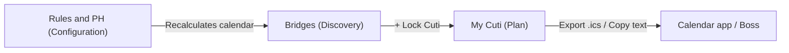

# CutiReady

**The Ultimate Leave Hack Untuk Pekerja Malaysia — Kerja Kuat, Cuti Lagi Kuat!**

CutiReady is a mobile-first, offline-capable web app that helps employees in Malaysia get the most rest out of a limited Annual Leave (AL) balance. It reads the public holiday calendar for the user's state, applies replacement holiday (*Cuti Ganti*) rules based on the Employment Act 1955 (Section 60D), and then finds every "bridge": a short run of workdays that, when taken as AL, joins public holidays and weekends into one long break.

The interface is written in casual Malaysian Malay (Bahasa Rojak) and uses a bold Neobrutalist visual style.

---

## Table of Contents

- [The Problem](#the-problem)
- [What CutiReady Does](#what-cutiready-does)
- [Core Features](#core-features)
- [App Structure: Three Views](#app-structure-three-views)
- [How the Engine Works](#how-the-engine-works)
- [Malaysian Holiday and Labour Law Coverage](#malaysian-holiday-and-labour-law-coverage)
- [Exports and Sharing](#exports-and-sharing)
- [Offline Support and Persistence](#offline-support-and-persistence)
- [Tech Stack](#tech-stack)
- [Project Structure](#project-structure)
- [Design System](#design-system)
- [Data Model](#data-model)
- [Limitations](#limitations)
- [Disclaimer](#disclaimer)

---

## The Problem

Planning leave in Malaysia is harder than it looks:

- **Holidays differ by state.** Each state has its own gazetted holidays, such as Sultan birthdays, Thaipusam, Nuzul Al-Quran, Kaamatan, Gawai, and Federal Territory Day.
- **Weekends differ by state.** Kedah, Kelantan, and Terengganu rest on Friday and Saturday. The other states and federal territories rest on Saturday and Sunday.
- **Replacement holidays shift dates.** A holiday that falls on a rest day moves to the next working day, and two holidays close together can push each other further along.
- **Company policies differ.** Some employers give only the statutory minimum of 11 paid holidays, some give around 15, and some observe every gazetted holiday.

Because of all this, people often miss the cheapest long weekends, where one or two AL days could give them four, five, or even nine days off in a row.

## What CutiReady Does

CutiReady does the calendar maths for the user. Given:

1. the **state** they work in,
2. which **holidays their company observes**,
3. their **remaining AL balance**, and
4. the **most AL days they are willing to spend on a single break**,

it builds a normalised calendar for the year, finds every possible long-weekend bridge, ranks each one by return on investment (days off per AL day spent), and lets the user lock in the bridges they want, track their remaining balance, and export the final plan.

---

## Core Features

| Feature | Description |
| :--- | :--- |
| **State-aware calendar** | Covers all 16 Malaysian states and federal territories. The weekend pattern (Sat–Sun or Fri–Sat) switches automatically when the state changes. |
| **EA 1955 replacement engine** | Automatically turns the next available workday into a *Cuti Ganti* when a holiday falls on a rest day. Holidays that land close together cascade to the next free workday. |
| **Optional Saturday replacement** | A toggle for companies that also give replacement leave when a holiday falls on the non-rest weekend day (Saturday for Sat–Sun states, Friday for Fri–Sat states). |
| **Bridge discovery** | Finds every window of 3 or more consecutive days off that includes at least one public or replacement holiday and needs no more AL than the user's limit. |
| **ROI scoring** | Each bridge gets a multiplier equal to total days off divided by AL days required. Bridges that need 0 AL are labelled "Free Cuti". Bridges at 4x or higher are labelled "Padu Gila". |
| **Smart filters** | Filter bridges by All, High ROI (3x and above), Zero AL, or by quarter (Q1 to Q4). |
| **Past-bridge hiding** | Bridges that have already ended are hidden by default and can be shown again with one tap. |
| **Day-strip visualisation** | Each bridge shows a colour-coded strip of tiles (workday, weekend, public holiday, replacement holiday, AL). AL tiles can be tapped to lock or unlock a single day. |
| **Leave locking** | "+ Lock Cuti" adds all AL days of a bridge to the user's plan. Partially locked bridges can be extended with "+ Sambung". |
| **Live AL balance** | Remaining AL is recalculated after every change and highlighted when it drops low. |
| **Company presets** | One-tap presets: EA 1955 Minimum (11 days), Corporate Standard (15 days), or All Gazetted holidays. |
| **Granular holiday checklist** | Individual non-compulsory holidays can be switched on or off. Compulsory EA 1955 holidays are locked on. |
| **Calendar export** | Download an RFC 5545 `.ics` file for a single bridge or for the whole plan. Works with Google Calendar, Apple Calendar, and Outlook. |
| **Boss-ready copy text** | Copies a ready-to-send leave request (single bridge) or a full yearly leave schedule to the clipboard for WhatsApp, Slack, or email. |
| **Installable PWA** | Can be installed to the home screen and keeps working offline after the first visit. |
| **Persistent settings** | All preferences and locked leave dates are saved in the browser's local storage. |

---

## App Structure: Three Views

The app runs as a single page. A fixed bottom navigation bar switches between three views, and each tab shows a live count badge.



### 1. Bridges: Discovery Mode

Source: [`src/pages/BridgesView.tsx`](src/pages/BridgesView.tsx)

- A hero section with a quick AL balance picker (stepper, direct input, and preset chips such as 2, 4, 5, 8, 10, 14, and 20 days).
- A status panel showing current AL balance, locked days or active holiday count, the current weekend pattern, and the past-bridge toggle.
- An "AL limit per break" control (1 to 5 days) that immediately changes which bridges qualify.
- Filter tabs with live counts.
- A list of bridge cards. Each card has the date range, total days off, AL cost, ROI badge, quarter, the day strip, and three actions: Lock, Export `.ics`, and Copy text.
- A colour legend modal that explains the day-strip tiles.

### 2. My Cuti: Plan Mode

Source: [`src/pages/MyPlanView.tsx`](src/pages/MyPlanView.tsx)

- A "Dossier Cuti Saya" summary with the remaining AL balance.
- Summary stats: total bridges, free (0 AL) bridges, longest possible break, and locked bridges versus AL days used.
- Plan-wide actions: export the whole plan as one `.ics` file, copy the full schedule for a manager, or reset all locked leave.
- The list of locked bridges. If nothing is locked yet, an empty state sends the user back to Bridges.

### 3. Rules and PH: Configuration Mode

Source: [`src/pages/RulesView.tsx`](src/pages/RulesView.tsx)

- A state selector with automatic rest-day mapping.
- Company holiday presets (11 / 15 / All) and the Saturday replacement toggle.
- Annual AL quota and AL limit per break settings.
- A holiday checklist filtered by category (All, Compulsory under the Act, Federal, State). Each entry shows English and Malay names, date, and badges.

A global header with a state selector, a reset-to-defaults button, and a "How to use" onboarding modal is available on every view.

---

## How the Engine Works

All scheduling logic is in [`src/engine/calendarEngine.ts`](src/engine/calendarEngine.ts). It is fully deterministic and runs on the client. Results are memoised and recalculated whenever the user's preferences change.

### Step 1: Build the Normalised Calendar

`buildNormalizedCalendar(year, state, weekendType, observedHolidayIds, allowSaturdayReplacements, plannedLeaveDates)`

1. Generates one entry for each day of the year, handling leap years.
2. Keeps only the holidays that the company observes **and** that apply to the selected state.
3. Labels each day as `WORKDAY`, `WEEKEND`, or `PUBLIC_HOLIDAY`, using the state's weekend pattern.
4. Runs the replacement holiday pass:
   - A holiday on the **rest day** (Sunday for Sat–Sun, Saturday for Fri–Sat) moves to the next available `WORKDAY`, which becomes a `REPLACEMENT_HOLIDAY`.
   - If the Saturday replacement toggle is on, a holiday on the **off day** (Saturday for Sat–Sun, Friday for Fri–Sat) also moves forward.
   - Because each replacement looks for the next day that is *still* a workday, holidays that land close together cascade naturally (for example, a Sunday holiday followed by a Monday holiday pushes the replacement to Tuesday).

### Step 2: Discover Bridge Opportunities

`findBridgeOpportunities(calendar, maxAlPerBridge)`

1. Scans every possible start position. A start is skipped if it is a workday that comes right after another workday.
2. Extends each window forward, counting the workdays inside it as required AL. The window is dropped once that count exceeds `maxAlPerBridge`.
3. A window qualifies as a bridge when:
   - the next day is a regular workday or the end of the year,
   - it contains at least one public or replacement holiday, and
   - it covers **3 or more** consecutive days off.
4. For each qualifying window, the engine records the start and end dates, total days off, AL dates required, quarter, a title made from the holiday names (for example "Hari Raya Aidilfitri Day 1 + Hari Raya Aidilfitri Day 2 Long Weekend"), and an ROI multiplier:

   ```
   roiMultiplier = totalDaysOff / alDaysRequired   (when AL > 0)
   roiMultiplier = totalDaysOff * 10               (when AL = 0, ranked as "free")
   ```

5. Duplicate windows with the same start and end are removed, keeping the longest break that needs the least AL. The result is sorted by date.

---

## Malaysian Holiday and Labour Law Coverage

### States and Weekend Patterns

| Weekend | States / Territories |
| :--- | :--- |
| **Friday–Saturday** | Kedah, Kelantan, Terengganu |
| **Saturday–Sunday** | Johor, Kuala Lumpur, Selangor, Penang, Perak, Pahang, Negeri Sembilan, Melaka, Perlis, Sabah, Sarawak, Labuan, Putrajaya |

### Holiday Dataset (2026)

Source: [`src/data/holidays.ts`](src/data/holidays.ts)

Each holiday has an English name, a Malay name, a date, a category (`FEDERAL` or `STATE`), an EA 1955 compulsory flag, and the list of states that observe it.

- **Compulsory under EA 1955, Section 60D:** Worker's Day, Agong's Birthday, National Day, Malaysia Day, plus the relevant state Ruler's or Governor's birthday, or Federal Territory Day.
- **Major federal celebrations:** New Year's Day (selected states), Chinese New Year (2 days), Hari Raya Aidilfitri (2 days), Hari Raya Haji, Wesak Day, Awal Muharram, Prophet Muhammad's Birthday, Deepavali (except Sarawak), and Christmas Day.
- **State and territory holidays:** Isra and Mi'raj, Thaipusam, Nuzul Al-Quran, Harvest Festival (Kaamatan), Hari Gawai, Sarawak Independence Day, and the birthdays of the Sultans, Rulers, and Governors of each state.

### Company Presets

| Preset | Behaviour |
| :--- | :--- |
| **EA 1955 (11 days)** | All compulsory holidays for the selected state, plus the first six other holidays that apply (standing in for the employer's own picks). |
| **Corporate (15 days)** | The first 15 holidays that apply to the selected state. |
| **All Gazetted** | Every federal and state holiday that applies to the selected state. |

Manually switching any individual holiday sets the preset to **Custom**.

---

## Exports and Sharing

Implemented in [`src/utils/icsExport.ts`](src/utils/icsExport.ts) with no third-party calendar libraries.

- **Single bridge `.ics`:** An RFC 5545 all-day event covering the full break. The end date is exclusive, as the standard requires. The description lists which AL dates to apply for.
- **Full plan `.ics`:** One calendar file (`CutiReady-2026-Holiday-Plan.ics`) with an event for every locked bridge, tagged with the user's state.
- **Leave request text:** A short bilingual message with the bridge name, date range, total days off, and AL dates. Ready to paste into WhatsApp or Slack.
- **Full schedule text:** A yearly summary listing every locked bridge, the total days off, and the total AL used. Suitable for sending to HR or a manager.

---

## Offline Support and Persistence

- **Progressive Web App:** Built with `vite-plugin-pwa`. The service worker updates automatically, the app runs in standalone portrait mode, and all build assets are precached so the app works without a network connection.
- **Font caching:** Google Fonts stylesheets and font files are cached with a cache-first strategy for up to one year.
- **Local persistence:** The Zustand store (`src/store/useLeaveStore.ts`) uses the `persist` middleware to save the state, weekend type, AL balance, AL limit per break, observed holidays, Saturday replacement setting, locked leave dates, and past-bridge visibility under the `cutiready-storage` key in local storage.
- **No backend:** All calculations run in the browser. No personal data leaves the device.

---

## Tech Stack

| Layer | Technology |
| :--- | :--- |
| UI framework | React 19 |
| Language | TypeScript 5 |
| Build tool | Vite 6 |
| State management | Zustand 5 (with `persist` middleware) |
| Date arithmetic | date-fns 4 |
| Styling | CSS custom properties (design tokens), Tailwind CSS 3, PostCSS, Autoprefixer |
| Icons | lucide-react |
| Class utilities | clsx, tailwind-merge |
| Offline / PWA | vite-plugin-pwa (Workbox) |
| Typography | Plus Jakarta Sans (Google Fonts) |

---

## Project Structure

```
CutiReady/
├── public/                     Static assets (favicon)
├── scripts/
│   └── check-tokens.js         Design-token linter: flags raw hex colours in source files
├── src/
│   ├── components/             Shared Neobrutalist primitives and domain components
│   │   ├── BrutalistButton.tsx     Tactile raised/pressed button primitive
│   │   ├── BrutalistCard.tsx       Card with coloured header banner
│   │   ├── BrutalistBadge.tsx      Pill badge primitive
│   │   ├── BrutalistInput.tsx      Input primitive
│   │   ├── BrutalistSelect.tsx     Select primitive
│   │   ├── BridgeCard.tsx          Long-weekend opportunity card
│   │   ├── DayStripTile.tsx        Colour-coded day tile used in bridge strips
│   │   ├── FilterTabs.tsx          All / High ROI / Zero AL / Q1–Q4 tabs
│   │   ├── SummaryStats.tsx        Plan metric chips
│   │   ├── HeroSection.tsx         Landing hero and AL balance picker
│   │   ├── Header.tsx              Brand, state selector, reset and help
│   │   ├── BottomNavBar.tsx        Fixed three-tab navigation
│   │   ├── HowToUseModal.tsx       Four-step onboarding modal
│   │   └── LegendModal.tsx         Day-strip colour legend
│   ├── data/
│   │   └── holidays.ts         2026 federal and state holiday dataset
│   ├── engine/
│   │   └── calendarEngine.ts   Normalised calendar, Cuti Ganti rules, bridge discovery
│   ├── pages/
│   │   ├── HomePage.tsx        Shell: header, active view, footer, bottom nav
│   │   ├── BridgesView.tsx     Discovery view
│   │   ├── MyPlanView.tsx      Plan view
│   │   └── RulesView.tsx       Configuration view
│   ├── store/
│   │   └── useLeaveStore.ts    Zustand store with local storage persistence
│   ├── types/
│   │   └── index.ts            Canonical TypeScript types and state mappings
│   ├── utils/
│   │   └── icsExport.ts        .ics generation and clipboard formatting
│   ├── App.tsx                 Root component and onboarding modal host
│   ├── main.tsx                React entry point
│   └── index.css               Design tokens, global styles, animations
├── .agent/                     AI agent rules and skills for this codebase
├── AGENTS.md                   AI agent enforcement protocol and design router
├── index.html
├── vite.config.ts              Vite and PWA configuration
├── tailwind.config.js
├── postcss.config.js
└── tsconfig.json
```

---

## Design System

CutiReady uses a high-contrast, tactile **Neobrutalist** look based on the Wallo design lineage.

- **Canvas and surfaces:** A warm butter background with crisp white cards.
- **Accent palette:** Electric yellow (primary actions, active tabs), flamingo pink (AL highlights), ocean cyan (replacement holidays, info), tropical mint (public holidays, high ROI), warm sand (warnings), and lavender (state badges).
- **Borders and shadows:** Thick solid black borders (3px to 4px) and hard 4px directional drop shadows with no blur.
- **Tactile buttons:** Buttons sit raised on an offset shadow and visibly press down into it when tapped.
- **Typography:** Plus Jakarta Sans in heavy weights (700 to 900), mostly uppercase headings with tight letter spacing.
- **Layout:** Mobile first. All content sits in a centred `.neobrutalist-container` no wider than 560px, with no horizontal overflow on screens 360px wide or larger.
- **Motion:** Short tab-entry and modal-pop animations that are turned off when the user prefers reduced motion.

### Day-Strip Colour Semantics

| Tile | Meaning |
| :--- | :--- |
| Slate | Weekend |
| Mint | Public holiday |
| Cyan | Replacement holiday (*Cuti Ganti*) |
| Pink, dashed border | Suggested AL day (not yet locked) |
| Pink, solid border | AL day locked into the plan |

All colours are defined as CSS custom properties in [`src/index.css`](src/index.css). Components use only `var(--...)` tokens, and [`scripts/check-tokens.js`](scripts/check-tokens.js) checks this by flagging any hardcoded hex value in component source files. The full rules for contributors and AI agents are in [`AGENTS.md`](AGENTS.md) and [`.agent/rules/`](.agent/rules/).

---

## Data Model

Key types from [`src/types/index.ts`](src/types/index.ts):

| Type | Purpose |
| :--- | :--- |
| `MalaysianState` | Union of the 16 states and federal territories. |
| `WeekendType` | `SAT_SUN` or `FRI_SAT`. |
| `HolidayDefinition` | A gazetted holiday with English and Malay names, date, category, compulsory flag, and observing states. |
| `CalendarDay` | One normalised day: date, day of week, type (`WORKDAY`, `WEEKEND`, `PUBLIC_HOLIDAY`, `REPLACEMENT_HOLIDAY`, `ANNUAL_LEAVE`), and holiday metadata. |
| `BridgeOpportunity` | A discovered long weekend: date range, total days off, AL required, ROI multiplier, AL dates, day slice, and quarter. |
| `UserPreferences` | All persisted user settings, including locked leave dates. |

---

## Limitations

- **Single year:** The holiday dataset and the default planning year are currently fixed to **2026**.
- **Holiday dates may change:** Islamic and lunar holiday dates depend on official announcements and moon sightings. Dates in the dataset may differ from the final gazette.
- **Simplified presets:** The 11-day and 15-day presets choose non-compulsory holidays by their order in the dataset. Users should adjust the checklist to match their actual company policy.
- **One leave type:** Only Annual Leave is modelled. Medical, emergency, and other leave types are not tracked.

---

## Disclaimer

CutiReady is a planning aid. Its replacement holiday logic follows the general principles of the Employment Act 1955 (Section 60D), but it is not legal advice. Actual entitlements depend on your employment contract, your company's gazetted holiday list, and official government announcements. Always confirm leave dates with your employer or HR department before making travel plans.
